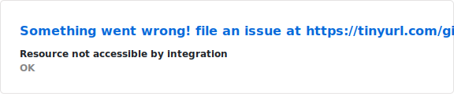
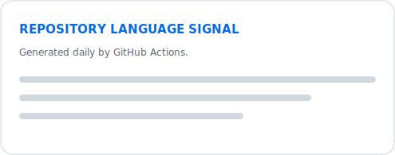

<!--
  GitHub profile README for https://github.com/onedord1
  Theme-aware assets are stored locally under ./assets and ./profile.
  Update the featured project URLs if your repository paths differ.
-->

<div align="center">
  <picture>
    <source media="(prefers-color-scheme: dark)" srcset="./assets/hero-dark.svg" />
    <source media="(prefers-color-scheme: light)" srcset="./assets/hero-light.svg" />
    
  </picture>
</div>

<div align="center">
  <a href="https://github.com/onedord1"></a>
  <a href="https://www.linkedin.com/in/abir-k"></a>
  <a href="mailto:kader.devops@gmail.com"></a>
</div>

<div align="center">
  
  
  
  
</div>

<br />

## `01 // identity`

<table>
<tr>
<td width="57%" valign="top">

### Yā, I am **Kader Khan** — also known as **Abir** 👋

I am a **Platform Engineer, DevOps Engineer and SRE** focused on building cloud-native systems that are **repeatable, secure, observable, scalable and recoverable**.

```yaml
profile:
  role: Platform Engineer / DevOps / SRE
  location: Dhaka, Bangladesh
  cloud: [AWS, GCP]
  specialties:
    - Kubernetes platform engineering
    - Infrastructure as Code
    - CI/CD and GitOps automation
    - Observability and DevSecOps
    - High availability and disaster recovery

current_mission:
  - build reliable Kubernetes delivery platforms
  - automate infrastructure with Terraform and Ansible
  - connect deployments to telemetry and incident response
  - test recovery paths instead of only documenting them
```

</td>
<td width="43%" valign="top">

### `operating principles`

```text
01  AUTOMATE repetitive operations
02  VERIFY every deployment
03  OBSERVE the entire delivery path
04  SECURE the software supply chain
05  DESIGN for regional and service failure
06  MAKE rollback and recovery executable
```

### `currently exploring`

- Advanced Kubernetes scheduling and networking
- GitOps promotion and progressive delivery
- Event-driven autoscaling with KEDA
- OpenTelemetry-based release observability
- Enterprise-grade golden images and platform security

</td>
</tr>
</table>

## `02 // platform orbit`

<div align="center">
  <picture>
    <source media="(prefers-color-scheme: dark)" srcset="./assets/platform-orbit-dark.svg" />
    <source media="(prefers-color-scheme: light)" srcset="./assets/platform-orbit-light.svg" />
    
  </picture>
</div>

## `03 // engineering arsenal`

<div align="center">
  <picture>
    <source media="(prefers-color-scheme: dark)" srcset="https://skillicons.dev/icons?i=aws,gcp,azure,kubernetes,docker,terraform,ansible,git,githubactions,gitlab,jenkins,prometheus,grafana,elasticsearch,kafka,rabbitmq,redis,postgres,mongodb,mysql,go,bash,linux,nginx&perline=12&theme=dark" />
    <source media="(prefers-color-scheme: light)" srcset="https://skillicons.dev/icons?i=aws,gcp,azure,kubernetes,docker,terraform,ansible,git,githubactions,gitlab,jenkins,prometheus,grafana,elasticsearch,kafka,rabbitmq,redis,postgres,mongodb,mysql,go,bash,linux,nginx&perline=12&theme=light" />
    
  </picture>
</div>

<br />

<div align="center">
  
  
  
  
  
  
  
  
  
  
</div>

<table>
<tr>
<td width="25%" valign="top">

#### ☁️ Cloud & Platform
`AWS` `GCP` `EKS` `ECS` `EC2` `VPC` `IAM` `ALB` `Route 53` `S3` `ECR`

</td>
<td width="25%" valign="top">

#### ⚙️ Delivery & GitOps
`GitHub Actions` `GitLab CI` `Jenkins` `ArgoCD` `FluxCD` `Helm`

</td>
<td width="25%" valign="top">

#### 📡 Observability
`Prometheus` `Grafana` `OpenTelemetry` `SigNoz` `EFK`

</td>
<td width="25%" valign="top">

#### 🛡️ DevSecOps
`Trivy` `Falco` `SonarQube` `Vault` `External Secrets`

</td>
</tr>
</table>

## `04 // delivery control loop`

<div align="center">
  <picture>
    <source media="(prefers-color-scheme: dark)" srcset="./assets/delivery-pipeline-dark.svg" />
    <source media="(prefers-color-scheme: light)" srcset="./assets/delivery-pipeline-light.svg" />
    
  </picture>
</div>

## `05 // systems I have engineered`

<table>
<tr>
<td width="33%" valign="top">

### ⚡ EKS Event-Driven Autoscaling

A Kubernetes application platform on **Amazon EKS** that scales workloads from **RabbitMQ queue depth** using KEDA.

**Engineering scope**

- Terraform-provisioned EKS, VPC, IAM and S3
- Secure GitHub Actions → ECR → Helm delivery
- AWS Load Balancer Controller and ACM TLS
- Velero backup and restore through Amazon S3

`AWS` `EKS` `KEDA` `RabbitMQ` `Terraform` `Helm` `Velero`

[Explore the project →](https://github.com/onedord1/DevOps-Projects)

</td>
<td width="33%" valign="top">

### 🌍 Multi-Region Disaster Recovery

A Terraform-based **warm-standby AWS platform** designed for controlled regional failover and business continuity.

**Engineering targets**

- S3 cross-region replication and DNS failover
- Reusable multi-region Terraform modules
- **RPO below 5 minutes**
- **RTO below 30 minutes**
- Automated readiness checks and DR drills

`AWS` `Terraform` `Route 53` `S3 CRR` `RTO` `RPO`

[Explore the project →](https://github.com/onedord1/DevOps-Projects)

</td>
<td width="33%" valign="top">

### 🔭 Observability-Driven GitOps

An end-to-end release platform built around **GitLab CI, ArgoCD, Helm, Kubernetes and External Secrets**.

**Engineering scope**

- Version-controlled environment promotion
- Secure secrets delivery with Vault integration
- Prometheus and OpenTelemetry release signals
- Reusable CI/CD templates and GitOps workflows

`GitLab CI` `ArgoCD` `Vault` `Prometheus` `OpenTelemetry`

[Explore the project →](https://github.com/onedord1/DevOps-Projects/tree/main/observability-driven-gitops-release-system)

</td>
</tr>
</table>

## `06 // professional impact`

**DevOps and Cloud Engineer — Anwar Technologies** · `October 2024 — February 2026`

- Architected an end-to-end DevSecOps platform using Terraform, Kubernetes, ArgoCD and GitLab CI.
- Engineered high-performance CI/CD workflows with parallelization and caching for faster, repeatable delivery.
- Implemented self-service GitOps deployments, automated reconciliation and rollback workflows.
- Developed reusable Terraform modules and version-controlled AWS infrastructure templates.
- Containerized enterprise applications to improve deployment consistency, scalability and resource utilization.

## `07 // live engineering telemetry`

<div align="center">
  <picture>
    <source media="(prefers-color-scheme: dark)" srcset="./profile/stats-dark.svg" />
    <source media="(prefers-color-scheme: light)" srcset="./profile/stats-light.svg" />
    
  </picture>
  <picture>
    <source media="(prefers-color-scheme: dark)" srcset="./profile/top-langs-dark.svg" />
    <source media="(prefers-color-scheme: light)" srcset="./profile/top-langs-light.svg" />
    
  </picture>
</div>

### `contribution signal // rainbow snake`

<div align="center">
  <picture>
    <source media="(prefers-color-scheme: dark)" srcset="./profile/github-snake-dark.svg" />
    <source media="(prefers-color-scheme: light)" srcset="./profile/github-snake-light.svg" />
    
  </picture>
</div>

> The snake, statistics and language cards are regenerated automatically by the included GitHub Actions workflow.

## `08 // connect`

<div align="center">
  <a href="https://www.linkedin.com/in/abir-k"></a>
  <a href="mailto:kader.devops@gmail.com"></a>
</div>

<br />

<div align="center">
  <sub><code>BUILD → VERIFY → SECURE → DEPLOY → OBSERVE → RECOVER → IMPROVE</code></sub>
</div>
